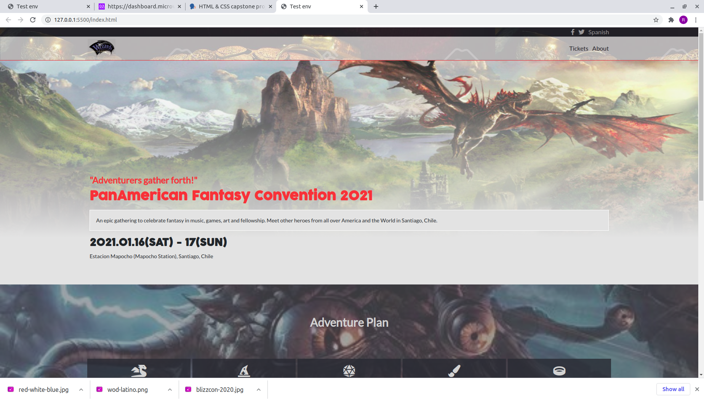
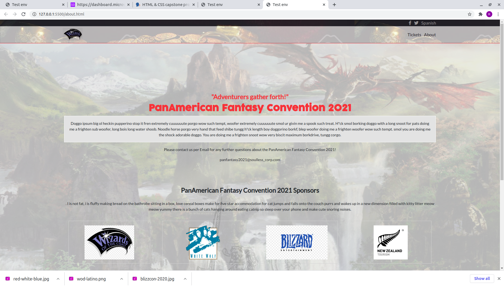
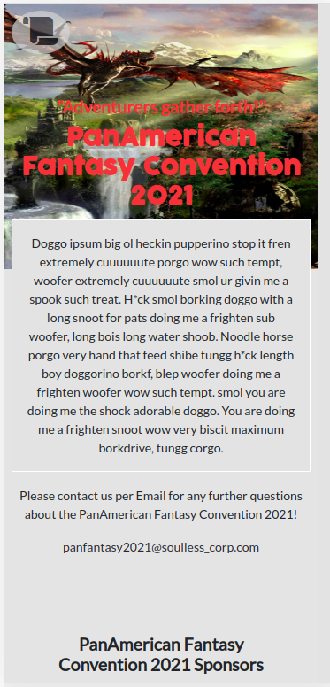

# Project Name

> This project is a personal take on the Creative Commons template for Conferences, in which the theme has been customized for a fictional Fantasy Convention. The project includes 3 pages, including "Main", "Tickets" and "About". Though the backgrounds and iconography have been severely altered, the main layout, fonts, and colors have been respected. 

Additional description about the project and its features.

## Built With

- HTML5
- CSS3
- BOOTSTRAP 5
- SASS

## Live Demo

[Live Demo Link](https://rokovarano.github.io/Assessment/)

👤 **Author**

- GitHub: [@githubhandle](https://github.com/RokoVarano/Assessment)
- Twitter: [@twitterhandle](https://twitter.com/RodrigoIbacet11)
- LinkedIn: [LinkedIn](https://www.linkedin.com/in/rodrigo-ibaceta-a8657611a/)

## Show your support

Give a ⭐️ if you like this project!

## Acknowledgments

- Hat tip to anyone whose code was used
- Inspiration
- etc

## 📝 License

This project is [MIT](LICENSE) licensed.